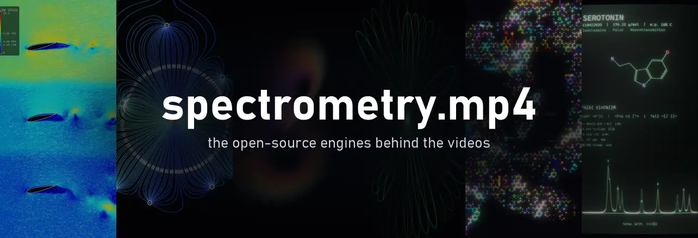
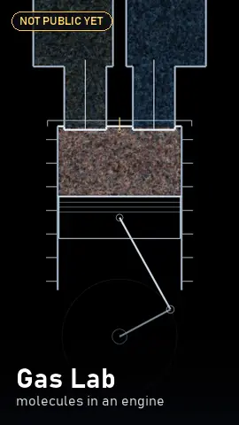
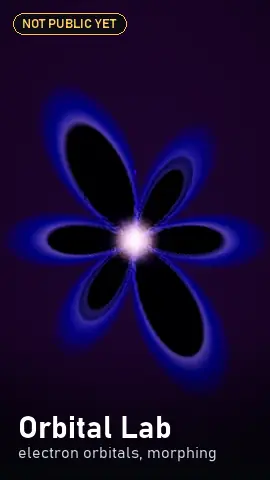
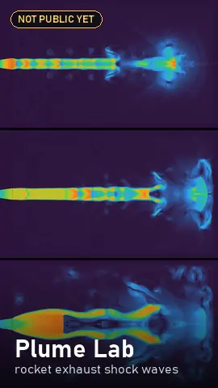
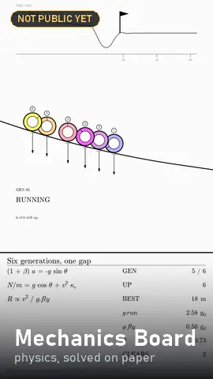
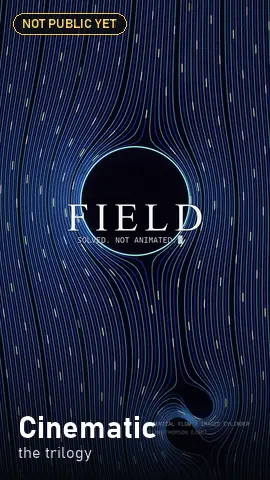
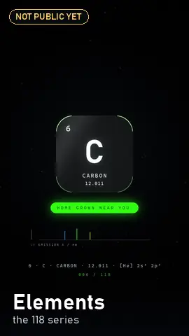
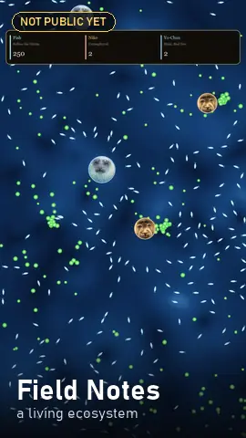
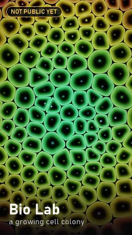
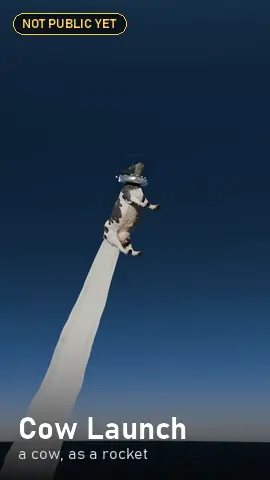

<div align="center">



### The code behind the [spectrometry.mp4](https://instagram.com/spectrometry.mp4) videos

Fluid sims, field lines, particle swarms, bouncing shapes and molecules.<br>
Written in Python, turned into video with ffmpeg. Free to use.

[](https://instagram.com/spectrometry.mp4)
[](https://www.youtube.com/channel/UChtdNI2BC1SmkmHEERA4dzg)
[](https://x.com/spectrometrymp4)<br>
[](LICENSE)
[](#try-one-in-five-minutes)
[](#questions)

</div>

Hey! If you got here from one of my videos, you're in the right place. Nothing on the channel is
animated by hand: a real simulation runs, and every frame it produces goes straight into the video.
This repo is where I share the engines that do that, so you can pull them apart and make your own
things with them.

## Find the engine behind a video

Tap the one that looks like what you saw.

<p align="center">
<a href="engines/wind-tunnel/README.md"></a>
<a href="engines/field-lines/README.md"></a>
<a href="engines/lattice-grid/README.md"></a>
<a href="engines/shape-physics/README.md"></a>
<a href="engines/attractors/README.md"></a>
<a href="engines/oscilloscope/README.md"></a>
<a href="engines/chemical-scope/README.md"></a>
<a href="chemical_profiles/README.md"></a>
<a href="engines/academia/README.md"></a>
</p>

### Not public yet

These made some of my newer videos, but their code isn't cleaned up for sharing yet. They'll
show up here when it is. Follow along on
[Instagram](https://instagram.com/spectrometry.mp4) in the meantime.

<p align="center">
<a href="https://instagram.com/spectrometry.mp4"></a>
<a href="https://instagram.com/spectrometry.mp4"></a>
<a href="https://instagram.com/spectrometry.mp4"></a>
<a href="https://instagram.com/spectrometry.mp4"></a>
<a href="https://instagram.com/spectrometry.mp4"></a>
<a href="https://instagram.com/spectrometry.mp4"></a>
<a href="https://instagram.com/spectrometry.mp4"></a>
<a href="https://instagram.com/spectrometry.mp4"></a>
<a href="https://instagram.com/spectrometry.mp4"></a>
</p>

Seen a video that isn't on either list?
[Ask which engine made it](https://github.com/ec175/spectrometry_public/issues/new?template=which-engine.yml).

## Try one in five minutes

You need **Python 3.10 or newer** and **[ffmpeg](https://ffmpeg.org/download.html)**. A GPU
makes things faster, but nothing needs one.

```bash
git clone https://github.com/ec175/spectrometry_public.git
cd spectrometry_public
python -m venv .venv
```

Turn the environment on. On Windows that's `.venv\Scripts\activate`; on macOS or Linux it's
`source .venv/bin/activate`. Then pick one:

**🎬 Make a full video right now.** [Chemical Profiles](chemical_profiles/README.md) is a finished
scene: one molecule, its spectra, about ten minutes from a fresh clone.

```bash
pip install -r chemical_profiles/requirements.txt
cd chemical_profiles
manim -ql -r 540,960 chemical_profile.py VerticalProfile_Aspirin
```

**📺 Put the CRT look on your own clip.** The [Oscilloscope](engines/oscilloscope/README.md) film
filter works on any video you already have.

```bash
pip install -r engines/oscilloscope/src/requirements.txt
python engines/oscilloscope/src/filter_cli.py your_clip.mp4 filmed.mp4 --glitch 0.8
```

**🧪 Play with a simulation.** Every engine page starts with a short **Start here** section you
can paste straight into Python. [Wind Tunnel](engines/wind-tunnel/README.md#start-here) is a
good first one.

## Use it in your own stuff

**Anyone can use this code**, for videos, school projects, your own engine, whatever you like.
It's [MIT licensed](LICENSE). The only thing I ask is that you **leave a trail back here**:

1. **Keep the two-line header** at the top of any file you copy. The license needs it anyway.
2. **Credit it** in your project's README or your video's description:
   ```
   Made with spectrometry.mp4 engines by Ethan Earl - github.com/ec175/spectrometry_public
   ```
3. **Or add the badge:**
   [](https://github.com/ec175/spectrometry_public)
   ```markdown
   [](https://github.com/ec175/spectrometry_public)
   ```

If you post something you made, tag [@spectrometry.mp4](https://instagram.com/spectrometry.mp4).
I'd love to see it.

> **Using an AI coding agent?** Point it at [`AGENTS.md`](AGENTS.md). It explains how the repo
> fits together and how to credit it. For a formal citation, use
> [`CITATION.cff`](CITATION.cff) (on desktop, it's the **Cite this repository** button).

## Questions

<details>
<summary><b>Do I need a GPU?</b></summary>
<br>

No. Every engine runs on a normal CPU. If you have an NVIDIA card, the engines that support it
use it automatically for the maths (CuPy) and the video encoding (NVENC), and quietly fall back to
the CPU if anything is missing. All the timings in these docs came from one RTX 2060 with an
i7-9700K, so read them as rough ratios.

</details>

<details>
<summary><b>Do I need LaTeX?</b></summary>
<br>

No. Most manim projects do, but the chemical profile scenes use plain text rendering (Pango)
everywhere, so you can skip the whole LaTeX install.

</details>

<details>
<summary><b>Why can't I re-make your exact videos?</b></summary>
<br>

The engines are the toolbox. The `scenes.py` files that arrange them into my finished videos
stay with me, because I'd rather hand you the parts than a button that copies my channel. Every
composition I've made is still listed in each engine's catalogue, with stills, because the idea is
usually the useful bit.

</details>

<details>
<summary><b>Can I make horizontal video?</b></summary>
<br>

Yes. Everything is written for vertical 1080×1920 because that's what I post, but the aspect
ratio lives in each engine's `RenderConfig`, never in the physics. Wind Tunnel even has a
`right` flow direction for the classic landscape tunnel.

</details>

<details>
<summary><b>Are the spectra real measurements?</b></summary>
<br>

No. They're representative simulations: peak positions come from literature values and
group-contribution estimates, so they're good for learning and for video, but not for citing.
Check against a real reference before you trust any band.

</details>

<details>
<summary><b>Something broke. What now?</b></summary>
<br>

[Open an issue](https://github.com/ec175/spectrometry_public/issues/new?template=bug.yml) with
the command you ran and the full error. Most problems are either ffmpeg missing from your PATH or
two engines sharing one virtual environment (use one per engine; Academia needs `numpy<2`).

</details>

<details>
<summary><b>What's in each folder?</b></summary>
<br>

```
engines/             one folder per engine: README, catalogue, stills, source
chemical_profiles/   a finished manim scene, the quickest way to a full video
docs/                the website, plus the preview clips on this page
tools/               rebuilds the catalogues and the stills pages
AGENTS.md            instructions for AI coding agents
```

</details>

## More

- **[All engines](engines/README.md)**: every engine on one page, plus the rules they all follow
- **[Full catalogue](engines/CATALOG.md)**: 193 objects and 83 compositions, indexed
- **[Chemical Profiles guide](chemical_profiles/GUIDE.md)**: from install to your own molecule
- **[Website](https://ec175.github.io/spectrometry_public/)**: the same gallery, as a page you can share

<div align="center">
<br>
<sub>Made by Ethan Earl · <a href="https://instagram.com/spectrometry.mp4">@spectrometry.mp4</a> · <a href="LICENSE">MIT</a></sub>
</div>
