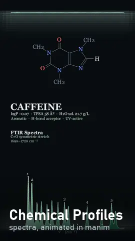

<div align="center">



# Chemical Profiles

**One molecule, the spectra that identify it, as a finished vertical video.**

[← Front page](../README.md) · [Full guide](GUIDE.md) · [All engines](../engines/README.md)

</div>

This is the one thing in the repo that renders a complete video as-is. It's a
[manim](https://www.manim.community/) scene: the molecule spins over its ¹³C and ¹H NMR spectra,
with peaks numbered to match the atoms, then cross-fades to an FTIR trace and plays each infrared
vibration while a cursor tracks the band it produces.

## Start here

From the repo root, in a fresh virtual environment:

```bash
pip install -r chemical_profiles/requirements.txt
cd chemical_profiles

manim -ql -r 540,960 chemical_profile.py VerticalProfile_Aspirin     # quick look
manim -qh -r 1080,1920 chemical_profile.py VerticalProfile_Aspirin   # full quality
```

The video lands under `chemical_profiles/renders/videos/`. The quick look takes a few minutes;
the full-quality render takes a while longer.

**You don't need LaTeX.** Most manim projects do, but these scenes use Pango text everywhere
instead of `MathTex`, so you can skip the whole MiKTeX / TeX Live install the manim docs walk you
through. You do need **ffmpeg** on your PATH.

## Make one for your own molecule

It's one subclass. Every molecule-specific value is a class attribute, and
`VerticalProfile_Aspirin` is the template: read it top to bottom and you've seen the whole data
contract. The [guide](GUIDE.md) walks through every attribute, what each quality flag actually
does, and what to do when something breaks.

## About the spectra

They're **representative, not measured.** Peak positions come from literature values and
group-contribution estimates, hand-corrected so the diagnostic bands land where they should. That
makes them good enough to teach with, but they're no substitute for running the instrument.

If you author a molecule, check every shift and every band against a reference before you render.
Nothing in the code validates them, and a wrong assignment is a factual error on screen in front
of everyone who watches it.

## Files

| file | what it is |
|---|---|
| `chemical_profile.py` | the scene, and `VerticalProfile_Aspirin` as the worked example |
| `spectro_lib.py` | the drawing library: spectra, structures, vibration animation |
| `manim.cfg` | output folder, frame rate, background colour |
| `requirements.txt` | manim (pinned), numpy, scipy |
| [`GUIDE.md`](GUIDE.md) | the long version, from install to authoring |

---

<div align="center">

**Using this?** Keep the header at the top of the files and credit the repo:
[how to credit](../README.md#use-it-in-your-own-stuff).<br>
[← Front page](../README.md) · [All engines](../engines/README.md)

</div>
