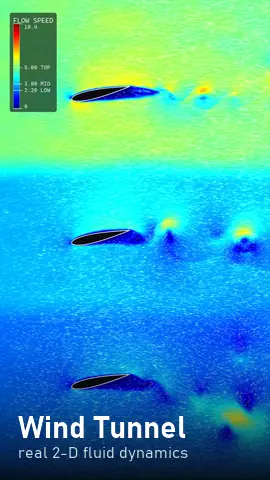
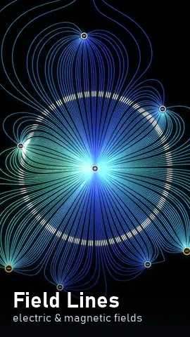
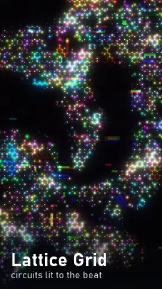
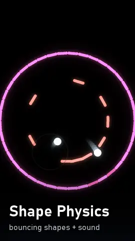
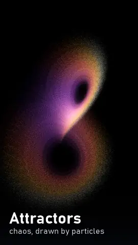
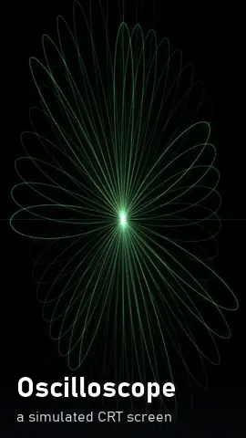
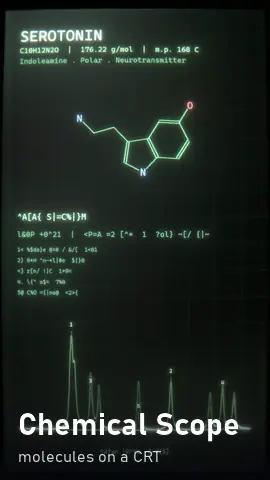
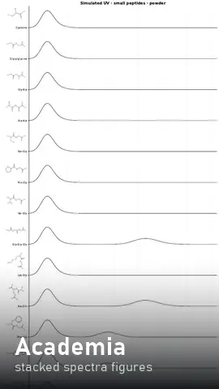

<div align="center">

# All engines

[← Front page](../README.md) · [Full catalogue](CATALOG.md) · [Chemical Profiles](../chemical_profiles/README.md)

</div>

Eight engines, each in its own folder with a README, a catalogue of everything it can make, a page
of stills, and the source. Seven of them compute something real in numpy and pipe raw frames
straight to ffmpeg; the eighth, Academia, makes the publication figures the whole thing grew out of.

<p align="center">
<a href="wind-tunnel/README.md"></a>
<a href="field-lines/README.md"></a>
<a href="lattice-grid/README.md"></a>
<a href="shape-physics/README.md"></a>
<a href="attractors/README.md"></a>
<a href="oscilloscope/README.md"></a>
<a href="chemical-scope/README.md"></a>
<a href="academia/README.md"></a>
</p>

| engine | what it makes |
|---|---|
| **[Wind Tunnel](wind-tunnel/README.md)** | real 2-D fluid dynamics with two solvers: flow past wings, falling plates, merging droplets, shock waves |
| **[Field Lines](field-lines/README.md)** | field lines of electric, magnetic and potential-flow fields, with glowing packets riding along them |
| **[Lattice Grid](lattice-grid/README.md)** | a lattice of circuit symbols that re-rolls on the beat, coloured by an RGB time delay |
| **[Shape Physics](shape-physics/README.md)** | balls, spinning shells, plinko and gears, where the simulation decides when the music plays |
| **[Attractors](attractors/README.md)** | tens of thousands of particles flowing through chaotic systems like the Lorenz butterfly |
| **[Oscilloscope](oscilloscope/README.md)** | a simulated CRT screen, plus a film filter you can put on any video |
| **[Chemical Scope](chemical-scope/README.md)** | 29 molecules with their FTIR and Raman spectra, drawn on that CRT |
| **[Academia](academia/README.md)** | stacked spectra figures for whole classes of molecules, as vector PDFs |

## What every engine has in common

**Previews are trustworthy.** Every engine drives its frames from real seconds (`t = i/fps`), so a
half-resolution preview at 30 fps and a full-resolution final at 60 fps are the same animation,
just sampled differently. Iterate on previews.

**Encodes are atomic.** Everything writes to `<name>.part.mp4` and renames only on success, so a
file with its final name is always finished and playable. A stray `.part.mp4` is safe to delete.

**GPU encoding is on by default**, behind a one-time check with an automatic CPU fallback, so a
missing or busy encoder slows a render down instead of killing it. Each engine that encodes video
has an environment variable to force the CPU path: `WT_NVENC=0`, `FL_NVENC=0`, `LG_NVENC=0`,
`SP_NVENC=0`, `OSC_NVENC=0`.

**Three renders at once is the ceiling** on consumer hardware. GeForce cards only allow a few
simultaneous NVENC encodes, so going wider gets you nothing.

**Video goes to `engines/<name>/src/out/`**, which git ignores. Academia writes its PDFs next to
its figure scripts instead.

**Orientation is your choice.** Everything was written for vertical 1080×1920 because that's what
I post, but none of it is limited to that. The frame shape lives in a `RenderConfig` and in the
geometry a composition picks, never in a solver or a physics module:

- **Wind Tunnel** solves in wind coordinates, and only the renderer decides which way is up, so
  `RenderConfig(flow="right")` at a wide size gives you the classic landscape tunnel.
- **Field Lines, Attractors and Lattice Grid** compute in normalised coordinates and don't know
  what an aspect ratio is.
- **Shape Physics** works in reference pixels with a scale factor.
- **The two CRT engines** size the screen as a fraction of the frame.
- **Academia** is matplotlib, so page size is just a figure argument.

Every number measured in these docs came off one machine, an RTX 2060 with an i7-9700K. Treat
timings as ratios rather than promises.

## Keeping the catalogues up to date

Each `engines/<name>/catalog.json` is the source of truth. The `CATALOG.md` beside it, the stills
page in its `frames/` folder, and [the index](CATALOG.md) are all generated from it:

```bash
python tools/build_catalogs.py
```

Edit the JSON, never the generated Markdown: the next run would silently undo your change.

---

<div align="center">

[← Front page](../README.md) · [How to credit this repo](../README.md#use-it-in-your-own-stuff)

</div>
